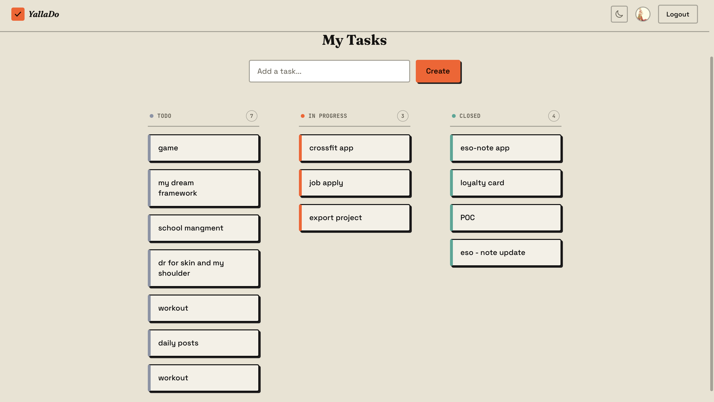
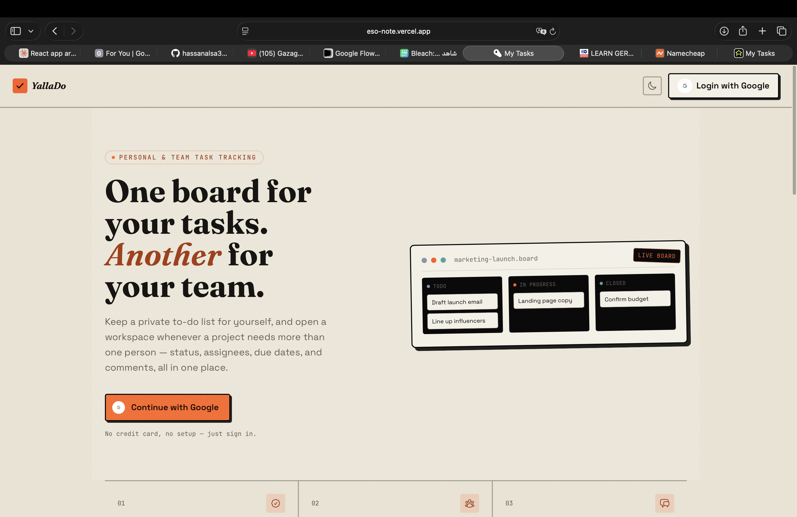
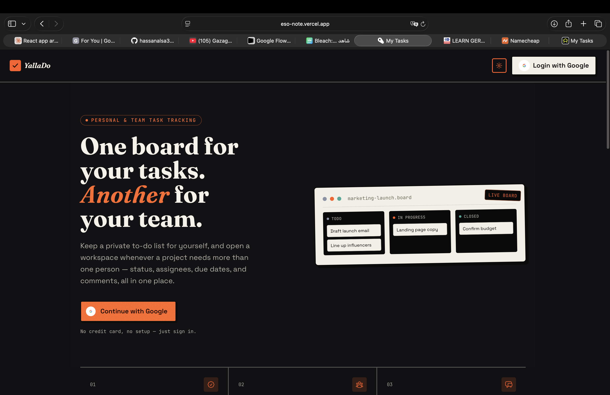
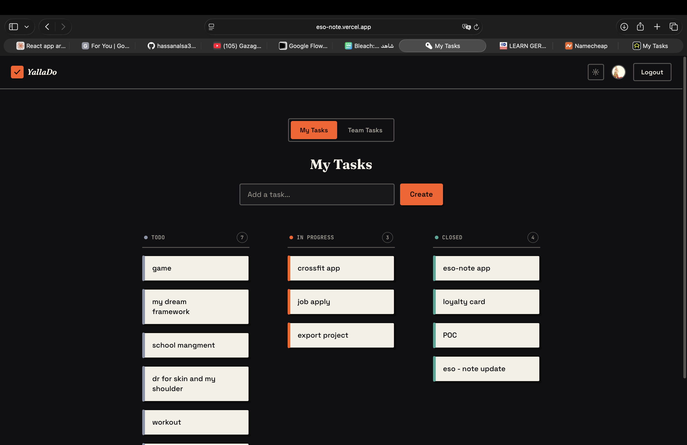

<div align="center">

# YallaDo

### Focused Task Management for Individuals & Teams

A modern, intuitive task management application built for personal productivity and team collaboration. Organize your work with personal and shared workspaces, real-time task tracking, and seamless team coordination.


[](https://react.dev)
[](https://vitejs.dev)
[](https://tailwindcss.com)
[](https://firebase.google.com)
[](#license)

[Getting Started](#-quick-start) • [Features](#-features) • [Screenshots](#-screenshots) • [Tech Stack](#-built-with) • [Contributing](#-contributing)

</div>

---

## ✨ Features

- **Personal Workspace** — Manage your individual tasks with a clean, distraction-free interface
- **Team Workspaces** — Create shared workspaces and collaborate with team members in real-time
- **Real-time Sync** — Changes sync instantly across all team members using Firestore
- **Drag & Drop** — Intuitive drag-and-drop interface for organizing tasks effortlessly
- **Task Details** — Rich task information including assignees, descriptions, and comments
- **User Authentication** — Secure Google Sign-In with profile photo support
- **Dark Mode** — Built-in theme toggle for comfortable all-day use
- **Responsive Design** — Seamlessly adapts from mobile to desktop screens
- **Team Collaboration** — Invite teammates, manage permissions, and stay connected

---

## 📸 Screenshots

<div align="center">

### Dashboard View


### Workspace Management


### Task Details & Comments


### Mobile Experience


</div>

---

## 🎯 Quick Start

### Prerequisites
- **Node.js** 16+ and npm 8+
- A Google Firebase project with Firestore and Authentication configured

### Installation

1. **Clone the repository**
   ```bash
   git clone https://github.com/yourusername/YallaDo.git
   cd YallaDo
   ```

2. **Install dependencies**
   ```bash
   npm install
   ```

3. **Configure Firebase**
   - Copy your Firebase configuration from the Firebase Console
   - Update `src/firebase.jsx` with your credentials:
   ```javascript
   const firebaseConfig = {
     apiKey: "YOUR_API_KEY",
     authDomain: "YOUR_AUTH_DOMAIN",
     projectId: "YOUR_PROJECT_ID",
     storageBucket: "YOUR_STORAGE_BUCKET",
     messagingSenderId: "YOUR_MESSAGING_SENDER_ID",
     appId: "YOUR_APP_ID"
   };
   ```

4. **Start the development server**
   ```bash
   npm run dev
   ```
   Open [http://localhost:5173](http://localhost:5173) in your browser

---

## 🏗️ Project Structure

```
YallaDo/
├── src/
│   ├── components/           # React components
│   │   ├── CreateTask.jsx    # New task creation form
│   │   ├── ListTasks.jsx     # Task list display
│   │   ├── TaskDetailPanel.jsx # Task details & comments
│   │   ├── WorkspaceMembers.jsx # Team member management
│   │   └── ...
│   ├── App.jsx               # Main application component
│   ├── firebase.jsx          # Firebase configuration
│   ├── firestore.jsx         # Firestore database utilities
│   ├── useAuth.jsx           # Authentication hook
│   ├── main.jsx              # Vite entry point
│   └── index.css             # Global styles
├── public/
│   ├── favicon.svg           # App icon
│   └── manifest.json         # PWA manifest
├── vite.config.js            # Vite configuration
├── tailwind.config.js        # Tailwind CSS configuration
├── firebase.json             # Firebase deployment config
└── package.json              # Dependencies & scripts
```

---

## 🚀 Available Scripts

```bash
# Start development server (HMR enabled)
npm run dev

# Build for production
npm run build

# Preview production build locally
npm run preview

# Run ESLint
npm run lint

# Deploy to Firebase
firebase deploy
```

---

## 🛠️ Built With

| Technology | Purpose | Version |
|-----------|---------|---------|
| **React** | UI Framework | 18.3.1 |
| **Vite** | Build Tool & Dev Server | 5.4.10 |
| **Tailwind CSS** | Utility-first CSS | 3.4.14 |
| **Firebase** | Backend & Authentication | 11.0.2 |
| **Firestore** | Real-time Database | Built-in Firebase |
| **react-dnd** | Drag & Drop | 16.0.1 |
| **react-hot-toast** | Notifications | 2.4.1 |
| **tailwind-merge** | CSS Class Merging | 1.x |

---

## 🔐 Authentication

YallaDo uses **Google Sign-In** for secure authentication:

- **OAuth 2.0** via Firebase Authentication
- Profile photo and email data automatically retrieved
- Graceful fallback to user initials if photos fail to load
- No password management required

### Setting Up Google Sign-In

1. Enable Google Sign-In in Firebase Console
2. Add authorized redirect URIs for your domains
3. Scopes automatically requested: `profile`, `email`

---

## 📊 Database Schema (Firestore)

### Workspaces Collection
```javascript
{
  id: "workspace-123",
  name: "Team Project",
  owner: "user-123",
  members: ["user-123", "user-456"],
  isTeam: true,
  createdAt: Timestamp
}
```

### Tasks Collection
```javascript
{
  id: "task-456",
  title: "Complete design mockups",
  workspaceId: "workspace-123",
  description: "Design UI for new feature",
  assignee: "user-456",
  completed: false,
  priority: "high",
  createdAt: Timestamp,
  updatedAt: Timestamp,
  comments: [
    { id: "c1", author: "user-123", text: "Great start!", timestamp: Timestamp }
  ]
}
```

---

## 🎨 Design System

### Color Tokens
YallaDo uses a custom Tailwind CSS color system with semantic tokens:

- **Ink** — Text and primary elements
- **Paper** — Backgrounds and surfaces  
- **Line** — Borders and dividers
- **Accent** — Interactive and highlight elements
- **Text** — Readable content (primary, muted)

All tokens use CSS variables for flexible theming:
```css
--c-ink: rgb(19, 19, 17);
--c-accent-fg: rgb(255, 89, 0);
--c-text: rgb(48, 48, 46);
```

---

## 📱 Browser Support

- Chrome 90+
- Firefox 88+
- Safari 15+
- Edge 90+

---

## 🤝 Contributing

We welcome contributions from the community! Here's how to get started:

1. **Fork** the repository
2. **Create** a feature branch (`git checkout -b feature/amazing-feature`)
3. **Commit** your changes (`git commit -m 'Add amazing feature'`)
4. **Push** to the branch (`git push origin feature/amazing-feature`)
5. **Open** a Pull Request

### Development Guidelines
- Follow existing code style and component patterns
- Write meaningful commit messages
- Test your changes in multiple browsers
- Update documentation as needed

---

## 🐛 Reporting Issues

Found a bug? Please [open an issue](https://github.com/yourusername/YallaDo/issues) with:
- Clear description of the problem
- Steps to reproduce
- Expected vs. actual behavior
- Browser and OS information

---

## 📝 License

This project is licensed under the **MIT License** - see the [LICENSE](LICENSE) file for details.

Developed with focus and intention for productive work.

---

<div align="center">

**[↑ Back to Top](#yallado)**

Made with ❤️ for focused work and team collaboration

</div>
